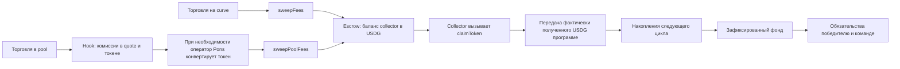

# Pons: Holders, комиссии и opening buy

Исследовательский пакет 2, 07.10.2026. Read-only; запусков и отправок нет.
Итог: путь средств и launch router подтверждены исходниками и чтением deployed
bytecode. Путь включения Holders установлен; необратимость его реализации не доказана.

## Доказательства

Локальный каталог: `.local/research/package2-20261007T145547Z/`.
`sources.json` содержит URL и SHA-256 текущей страницы создания и её JS chunks.
`*-sourcify.json` — ответы Sourcify с ABI, исходниками, match status и bytecode.
`live-2026-10-07T15-02-01-845Z.json` — фиксированный latest-блок `0x4ebcebc`,
hash `0x392b25f4b385583f2ef2727280c92d79ba60c704e5f931b391d820328a06113b`.
Повторное чтение hash совпало. Это один публичный RPC, не finalized admission.

| Контракт | Адрес | Sourcify | Сравнение RPC с onchainBytecode Sourcify |
|---|---|---|---|
| Fee escrow | `0xd3AFEB2a57f70eF218Aa82451c51B2fb0416Ac9e` | match | Точное совпадение |
| Launch-and-buy | `0xe33E9E479dF8802cb0866d5d05258bEc4cF62948` | exact_match | Точное совпадение |
| Launch factory | `0x7eD598BcEf8bd9Edd8C97A195C6d13f40801EC7e` | exact_match | Точное совпадение |
| Launch deployer | `0x3711ceA4feaDE896C913C68F01Eda97Cb06D1A42` | exact_match | Точное совпадение |
| Meme hook | `0xE5e702641Ea86F4ae6cC3cDaeD2B886f976Be044` | match | Точное совпадение |
| Holders factory proxy | `0x70e95CC5f03DB2906081E7a8D16e4C4209291507` | match, только proxy | Точное совпадение proxy |

Sourcify `match` не называем `exact_match`. Сравнивали полученный runtime с
onchainBytecode сервиса, не выполняли собственную перекомпиляцию всех контрактов.
Источник для каждого адреса: `https://sourcify.dev/server/v2/contract/4663/<address>?fields=all`.
Например, [router](https://sourcify.dev/server/v2/contract/4663/0xe33E9E479dF8802cb0866d5d05258bEc4cF62948?fields=all).

## Holders: что делает интерфейс

В [текущем UI](https://ponsfamily.com/launchpad/create), сохранённом `chunk-3.js`,
функция `enableFeeSharing` выполняет:

1. `distributorFactory.createFor(token)`; получает адрес через `distributorOf(token)`.
2. `launchFactory.transferCreatorFeeRecipient(token, distributor)`.

`chunk-22.js` при Holders сначала запускает токен с кошельком пользователя как
получателем, затем вызывает эти два шага. При отказе передачи UI сообщает, что
launch состоялся, но fees остаются у кошелька; продолжение доступно на странице токена.
Режимы wallet/buyback/holders представлены radio-выбором одного назначения.

Это подтверждает модель дополнительной программы поверх Pons. Для нашего первого
шаблона получателем будет свой collector с самого запуска. Одновременная отправка
всего потока в Holders и в наш collector невозможна через одно поле recipient.
Отдельный splitter был бы новой финансовой механикой и не входит в текущий пакет.

### Пределы утверждения «навсегда»

Прочитан EIP-1967 implementation slot фабрики Holders:
`0xa5ce545942caed85267db00abbdba89dac675088`. Исходник реализации в Sourcify не найден (404).
Sourcify подтверждает proxy, а не логику распределения или её upgrade authorization.

Для публичного [Community-токена](https://ponsfamily.com/launchpad/0xedf9a11147011da6188f603425708fa33c55d71f)
`distributorOf` вернул `0x066d55a3198E540D2e629404b4b9d74A06c9Fe59`.
Его runtime запрашивает implementation у адреса
`0xa125492aca28449d2291f5415a818697345cfa09` и делает delegatecall.
Прямое чтение этого beacon вернуло implementation
`0x54221b484E852a199BF8db28381D93343b16f18c` и ненулевой owner
`0x0f963968Fb82D9227c64dff7D9c4e44A7Fe66514`.
Исходники этих адресов также не получены через Sourcify; Blockscout ответил 403,
страницы Etherscan недоступны через web tool.

ABI фронта содержит epochs/Merkle root, две суммы quote/coin и срок claims.
Это не доказательство формулы «баланс × время» и не доказательство возможности
или невозможности смены recipient/upgrade. Заявление UI об окончательной передаче
пока остаётся непроверенным. Это ограничение относится к Holders, не мешает
проектировать наш собственный модуль без него.

## Путь денег

На curve `sweepFees` распределяет накопленные комиссии; доступность internal
buyback зависит от условий и оператора. Для первого профиля предлагается buyback off.
В pool `sweepPoolFees` разрешён оператору или creator recipient. Recipient не может
выполнить его, когда `_requiresTrustedOperator` обнаружил комиссии в project token
либо накопленный buyback. Тогда ждём Pons operator; не подменяем это ошибкой цикла.
Если все нужные средства уже в quote и internal swap не требуется, collector может
вызвать sweep самостоятельно. Промежуточная graduation phase также требует ожидания.

Escrow ведёт баланс по `(recipient, asset)`, объединяя разные источники. `claimToken`
платит именно `msg.sender`, поэтому вызов должен идти из collector. Keeper вызывает
метод collector, а не забирает его баланс напрямую из escrow. Доступны полное и
частичное получение. `creditToken` открыт любому и учитывает реальную дельту баланса:
escrow balance сам по себе не доказывает, что все деньги — торговые комиссии.

Предложение для нашего ядра: collector привязан к одному токену/quote/program,
передаёт поступления только программе; программа учитывает реальную дельту и
никогда не считает один перевод повторно. Разделение 50/50 происходит при расчёте
цикла в программе, не в collector. Старый QIANQI split 90/5/5 не переносится.
Донаты и сторонние escrow credits нужно явно описать как отдельный источник
пополнений либо исключить по согласованному правилу; это ещё открыто.

Сбой нового sweep/claim не должен блокировать уже созданные обязательства и выплаты.
Газ оператора финансируется отдельно. Полная сумма после graduation не гарантированно
поступит по расписанию: часть может ожидать внешней конвертации.

## Launch-and-buy

В verified `PonsV2LaunchAndBuy.sol` проверены условия:

- Router проверяет `factory.canLaunch(msg.sender)` и вызывает trusted `launchTokenFor`.
- Initiator сохраняется как исходный пользователь; collector можно задать отдельным recipient fees.
- `quoteIn > 0`; `creatorFeeRecipient` и покупательский recipient должны быть ненулевыми.
- Для USDG нужен allowance router на сумму покупки; ETH value равен только launch fee.
- Для native value равен launch fee + quoteIn.
- Создание и BUY — одна транзакция; revert покупки откатывает и launch.
- Переданный `minTokensOut` ограничивает результат; остаток quote возвращается вызывающему.
- Покупательский recipient добавляется к snipe exemptions; максимум 31 дополнительный адрес.

Наш UI не должен повторять найденный fallback фронта Pons, который может оставить
`minTokensOut=0`, если preview не удался. Для нового интерфейса предлагаем требовать
успешную симуляцию и явный минимум; при отсутствии allowance сначала approve и
новый preview. Это предложение для реализации, ещё не реализованный код.

Opening BUY идёт через router: индексатор должен доказать payer/recipient/net spend,
включая refund и launch block. Старые direct-buy adapters автоматически этот маршрут
не подтверждают. Нужна отдельная фикстура; не обещать начисление билетов до её проверки.

## Расхождение GitHub и verified sources

GitHub `44a3db9` содержит LaunchDeployer с обычным CREATE и без salt в его структуре.
Verified source действующего deployer содержит CREATE2 и `predictLaunchAddresses`.
Это конкретное подтверждение, что GitHub HEAD нельзя использовать как deployed ABI.
Для нового графа берём verified-профиль адресов; до каждой подписи перепроверяем
экономику, factory/deployer/forwarder bindings и code hashes.

Следующий документ: [предложение графа запуска](DEPLOYMENT_BLUEPRINT.md).
